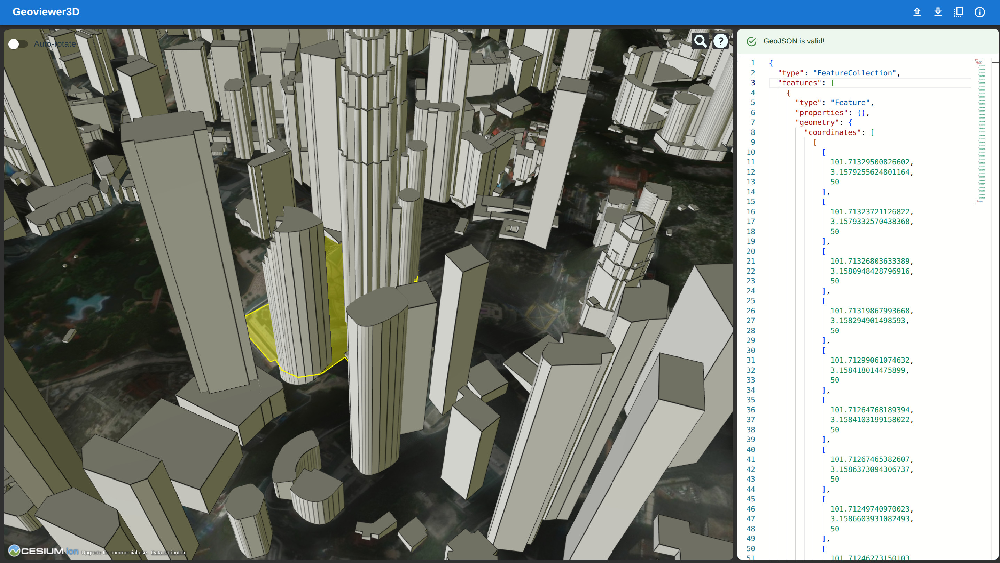

# Geoviewer3D
A browser-based spatial data inspector and 3D GeoJSON viewer. The V2 foundation keeps the existing editor and globe experience while introducing a deterministic, independently tested GeoJSON inspection package.

## Live app

There is a live working demo hosted on github pages: https://nishynair.github.io/Geoviewer3D/

## Usage
The web app uses React, Monaco, and Cesium. At the repository root, create `.env.local` with your Cesium Ion access token:

    VITE_CESIUM_TOKEN=<your Cesium Ion access token>

Then install dependencies and run the app or checks from the repository root:

    npm install
    npm run dev
    npm test
    npm run typecheck
    npm run lint
    npm run build

The default editor/viewer sample is under `apps/web/src/assets/`. The static GitHub Pages workflow reads `VITE_CESIUM_TOKEN` from a repository secret and publishes the production build.

## Project direction

- [Domain language](./CONTEXT.md)
- [Architecture and current boundary](./docs/ARCHITECTURE.md)
- [Phase 1 review and verification](./docs/PHASE1_REVIEW.md)
- [V2 handoff](./docs/CODEX_HANDOFF.md)
- [V2 specification](./docs/V2_SPEC.md)

## License
GPLv3. Available in [LICENSE](./LICENSE).
