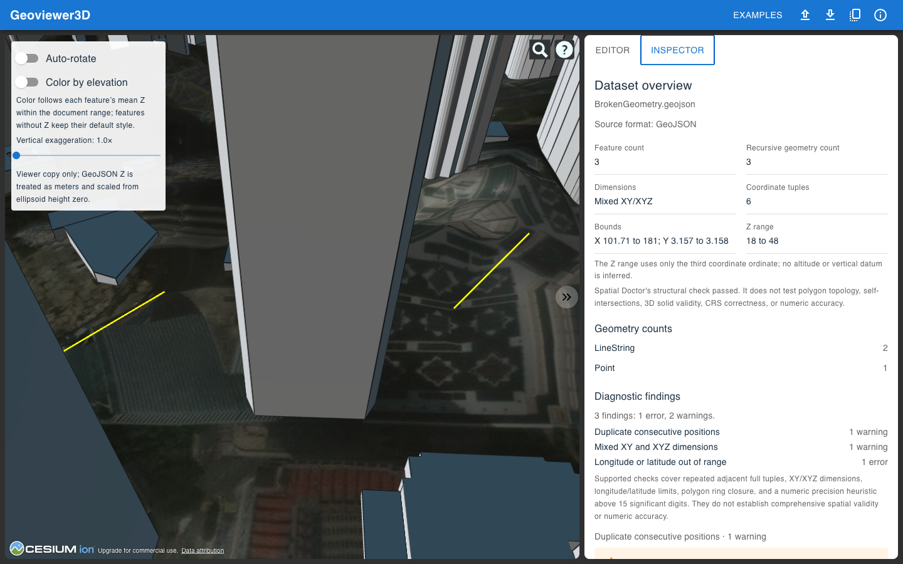
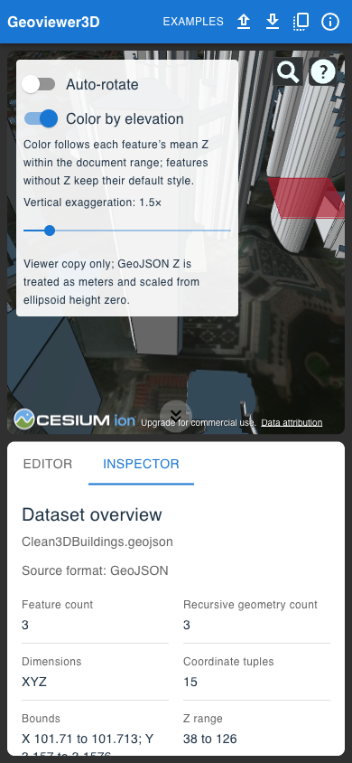

# GeoViewer3D

GeoViewer3D is a browser-based GeoJSON editor, spatial inspector, and 3D viewer.
It keeps the source editable while it reports what its supported checks found
and how eligible geometry appears on a globe.

[Open the hosted app](https://nishynair.github.io/Geoviewer3D/) ·
[Try the demos](#try-it) ·
[Install Spatial Doctor](https://www.npmjs.com/package/@nish-andran/spatial-doctor) ·
[View the V1 source](https://github.com/Nishynair/Geoviewer3D/tree/v1-handcrafted)

The hosted app follows the GitHub Pages build from `main`. The screenshots below
compare the original V1 editor/viewer with the V2 inspection workflow in this
repository.

<div align="center">
  
  
</div>
<p align="center"><em>V1: edit GeoJSON beside the globe. V2: retain that workflow and add a report, source navigation, and safe feature display.</em></p>

## From V1 to V2

V1 began as a GeoJSON text editor paired with a Cesium globe. V2 keeps the
editor and viewer, then adds a clear first-use path, three focused demos, a
Spatial Doctor report, source-aware findings, explicit repair previews, and a
supported JSON-FG view. The [V1 tag](https://github.com/Nishynair/Geoviewer3D/tree/v1-handcrafted)
shows the earlier project state.

I want to explore how AI could help people reason about spatial data. This
release is the deterministic foundation for that work: its summaries and
findings come from explicit code, with their limits visible. The app does not
make AI calls or generate AI diagnoses.

## Try it

1. Open the hosted app or choose one of the demos in the first-use panel.
2. To inspect your own file, choose a GeoJSON file or drop it into the workspace.
   Supported JSON-FG is limited to Core Feature and FeatureCollection documents
   with an ordinary GeoJSON `geometry` member.
3. Read the Dataset overview and Diagnostic findings. Open **Editor** to inspect
   or edit the original source.

The app opens with **Clean3DBuildings**. The same three demos are available from
the first-use panel and **Examples** menu:

| Demo | What it shows |
| --- | --- |
| `Clean3DBuildings` | Authored XYZ polygons, elevation coloring, and a clean report. They are illustrative polygons, not surveyed or extruded building models. |
| `BrokenGeometry` | Repeated positions, mixed XY/XYZ dimensions, and an out-of-range point. The unsafe feature stays in the source but is omitted from the globe. |
| `ElevationTerrain` | Coordinate Z facts and line profiles, plus an optional terrain comparison that requests samples from Cesium. |

These are small authored fixtures with illustrative values. Their provenance,
license, modifications, and purpose are recorded in
[Built-in demo data](./docs/DEMO_DATA.md). The earlier KLCC example remains in
the **Examples** menu.

<p align="center">
  
</p>
<p align="center"><em>The same authored Clean3DBuildings fixture in the mobile layout.</em></p>

## What the report means

The Inspector shows values from the current document report, including feature
count, recursive geometry counts, coordinate tuple count, XY bounds, dimensions,
and `coordinates.zRange`. The Z range is the minimum and maximum of the third
coordinate ordinate only. It does not identify altitude or a vertical datum.

Spatial Doctor performs structural GeoJSON validation and five coordinate
checks:

- **Repeated adjacent tuple** — a warning when a full coordinate tuple repeats
  its immediate predecessor.
- **Mixed XY/XYZ dimensions** — a warning when the document contains both
  two-ordinate and three-ordinate tuples.
- **Longitude/latitude out of range** — an error for finite longitude outside
  `[-180, 180]` or latitude outside `[-90, 90]`. The affected feature geometry
  is withheld from the globe.
- **Unclosed polygon ring** — an error when a ring's last tuple does not equal
  its first. A safely readable open ring can be explained from the source even
  though invalid geometry is not rendered.
- **Excess coordinate precision** — a warning when a finite ordinate has more
  than 15 significant digits in the shortest JavaScript number representation.
  This is a deterministic heuristic; JSON parsing may already have discarded
  differences in the original number text.

Finding totals count emitted findings; they are not a health score. “No findings
from the supported checks” does not establish comprehensive spatial validity.
The app does not test polygon topology, self-intersections, 3D solid validity,
CRS correctness, or numeric accuracy. Structurally invalid documents remain
editable, but their geometry is not sent to the viewer.

## How the pieces fit

```mermaid
flowchart LR
  file["Local GeoJSON or supported JSON-FG file"]
  source["Browser app: source text and JSON parsing"]
  document["SpatialDocument: source plus parsed value"]
  adapter["App-owned JSON-FG adapter when needed"]
  doctor["@nish-andran/spatial-doctor"]
  report["Inspection report"]
  inspector["Inspector and app-owned source mapping"]
  gate["Safe viewer gate"]
  cesium["Cesium globe"]
  services["External Cesium Ion terrain and OSM buildings; Bing imagery"]
  terrain["Explicit terrain comparison"]

  file --> source --> document
  document -->|GeoJSON| doctor
  document -->|supported JSON-FG| adapter --> doctor
  doctor --> report --> inspector --> gate
  gate -->|eligible geometry only| cesium
  cesium <--> services
  inspector -->|selected feature coordinates on request| terrain --> services
```



File reading, parsing, inspection, repairs, and format-conversion previews run
in the browser; there is no app backend. The globe requests external Cesium Ion
terrain, Cesium Ion-hosted OpenStreetMap building tiles, and Bing imagery. Those
map requests can reveal the area in view. Choosing terrain comparison sends the
selected feature's coordinates to Cesium for terrain sampling. Monaco also
loads editor assets from jsDelivr. See [Architecture](./docs/ARCHITECTURE.md)
for ownership and supported boundaries.

## Use Spatial Doctor in a project

The published `@nish-andran/spatial-doctor` **1.0.0** package provides ESM
JavaScript and TypeScript declarations. It accepts parsed values; the caller
handles text parsing.

```sh
npm install @nish-andran/spatial-doctor
```

```js
import {
  inspectGeoJSON,
  measureGeoJSONGeometry,
} from '@nish-andran/spatial-doctor';

const report = inspectGeoJSON(JSON.parse(sourceText));
if (report.valid) {
  console.log(report.summary.featureCount, report.coordinates.zRange);
}

const line = measureGeoJSONGeometry({
  type: 'LineString',
  coordinates: [[101.71, 3.15, 50], [101.72, 3.16, 52]],
});
console.log(line?.threeDimensionalLength);
```

The package has no React, Cesium, editor, or app dependency. Its
[README](./packages/spatial-doctor/README.md) documents report shapes, the five
diagnostics, measurement assumptions, units, and unavailable results. The
source-mapping ranges are resolved by the web app against the current text;
`inspectGeoJSON` itself does not receive or parse source text.

## Develop locally

Use Node.js 20 or later. For Cesium imagery and terrain, put your own Ion token
in the repository-root `.env.local` file; never commit that file.

```sh
npm install
npm run dev
npm test
npm run typecheck
npm run lint
npm run build
```

The static GitHub Pages workflow builds from `main` at `/Geoviewer3D/` and
publishes the site from `dist`.

More detail: [Architecture](./docs/ARCHITECTURE.md) ·
[Demo provenance](./docs/DEMO_DATA.md) ·
[Phase 5 workflows](./docs/PHASE5_WORKFLOWS.md) ·
[Spatial Doctor API](./packages/spatial-doctor/README.md) ·
[V2 specification](./docs/V2_SPEC.md)

## License

GPLv3. See [LICENSE](./LICENSE).
