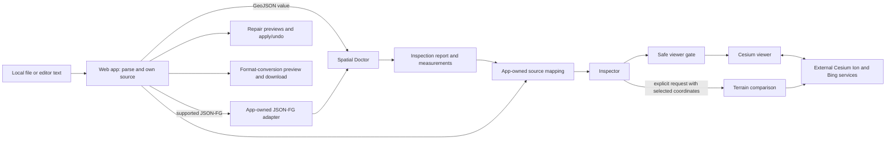

# Architecture

GeoViewer3D is a static browser application for editing, inspecting, and viewing
spatial data. The web app owns the user experience and format-specific work;
`@nish-andran/spatial-doctor` provides reusable, deterministic GeoJSON
inspection and measurement. The app has no backend and makes no AI calls.

## Data flow and ownership

The `apps/web` workspace reads files, retains the exact editable source text
and filename, parses JSON, and owns the canonical `SpatialDocument`. It detects
source format, adapts supported JSON-FG to an ordinary GeoJSON geometry view,
maps diagnostics and features back to the current source, and presents the
report. Repairs are previewed before an explicit apply; undo restores the exact
prior text and filename. Format conversions are previewed with a preservation
account and downloaded without replacing the editor's source.

The `packages/spatial-doctor` workspace accepts an already-parsed value through
`inspectGeoJSON(input)` and `measureGeoJSONGeometry(input)`. It validates
GeoJSON and reports counts, coordinate summaries, stable diagnostics, and
measurements. It does not parse source text, resolve source offsets, or depend
on React, Monaco, Cesium, or the web app. The app resolves optional source
ranges against the current text; those ranges are not produced by the package.

The Inspector displays report values and diagnostic explanations. Feature and
coordinate references are used only when they resolve to the current
document. Invalid or unsafe geometry is omitted from the Cesium view; a
dataset-wide issue does not create a feature selection. Valid siblings can
remain visible when an individual feature is unsafe. The canonical source is
kept intact while the viewer receives an eligible derived geometry view.

## Supported formats and checks

The app accepts GeoJSON and a bounded JSON-FG subset: Core Feature and
FeatureCollection roots with an ordinary GeoJSON `geometry` member. The
app-owned adapter uses that geometry for inspection and display while retaining
the original JSON-FG source. Native `place`, `time`, and CRS metadata are not
rendered as geometry; the app does not reproject coordinates. Conversion
previews account for preserved, changed, approximated, and lost information,
and block cases where GeoJSON foreign members would gain JSON-FG meaning.

The package reports feature and recursive geometry counts, coordinate-tuple
count, XY/XYZ/mixed/empty dimensions, ordinary X/Y bounds, and a Z range from
the third ordinate. It emits structural validation diagnostics and five
coordinate-check families: repeated adjacent tuples, mixed XY/XYZ dimensions,
longitude/latitude outside the supported range, unclosed polygon rings, and
excess coordinate precision. The precision check is a deterministic heuristic
over parsed JavaScript numbers, not recovered source-number spelling. These
checks do not establish comprehensive spatial validity: they do not test
self-intersections, general topology, CRS correctness, or 3D solid validity.

Geometry measurements use a spherical horizontal-distance approximation and
make their assumptions and unavailable results explicit. The package treats
Z as meters for arithmetic but does not infer or convert a vertical datum. The
web app owns viewer styling, vertical exaggeration, selected-feature
terrain-comparison requests, and the presentation of those results.

## Browser and network boundary

File reading, source parsing, inspection, repair previews, and conversion
previews run in the browser. There is no application server receiving uploaded
files. Rendering uses Cesium Ion terrain and hosted OpenStreetMap building
tiles, plus Bing imagery; these map requests can disclose the displayed area.
An explicit terrain comparison sends the selected feature's coordinates to
Cesium for sampling. Monaco editor assets load from jsDelivr. Map rendering and
terrain comparison therefore require network access even though document
inspection is local.

## Development and deployment

The root npm workspace provides the web app and Spatial Doctor. Use Node.js 20
or later with `npm install`, then `npm run dev`, `npm test`,
`npm run typecheck`, `npm run lint`, or `npm run build`. The Vite build keeps
the `/Geoviewer3D/` base path and emits the static site to root `dist` with
Cesium assets alongside it.

The GitHub Pages workflow installs from the root lockfile, builds the root
workspace, normalizes the Cesium asset directory, and publishes `dist` when
`main` is updated. Its build uses the `VITE_CESIUM_TOKEN` repository secret;
local builds can read the same variable from the ignored repository-root
`.env.local` file. Never commit that local configuration.
